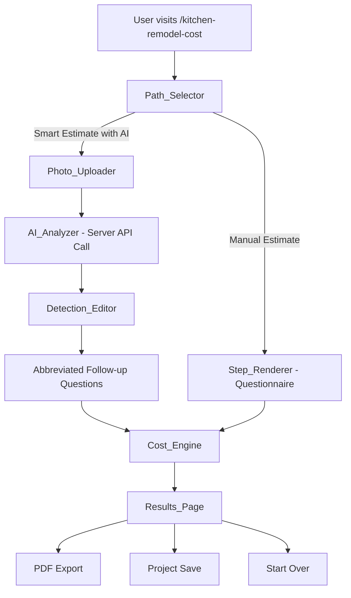

# Design Document: AI Kitchen Estimator

## Overview

This design transforms the existing `/kitchen-remodel-cost` page from a simple step-by-step questionnaire into a premium, AI-powered guided estimation experience. The feature introduces two distinct paths — an AI photo analysis path and a manual questionnaire path — that converge on a shared premium results page.

The AI path uses OpenRouter's vision API to analyze uploaded kitchen photos and automatically detect materials, dimensions, and condition, dramatically reducing the number of manual inputs required. The manual path retains the proven step-by-step card-based UX but upgrades the visual design to match the premium TurboTax/Apple onboarding style.

Both paths feed into a shared `Cost_Engine` that produces detailed breakdowns, and results are rendered on a premium `Results_Page` with AI observations, material recommendations, contractor questions, and PDF export.

### Key Design Decisions

1. **Single route, wizard pattern**: The entire experience lives at `/kitchen-remodel-cost` using a client-side wizard state machine — no sub-routes needed.
2. **Configuration-driven architecture**: Steps, options, and cost parameters are driven by configuration objects, enabling future reuse for bathroom/roofing estimators.
3. **Client-first with server API call**: All wizard state lives client-side (React state + localStorage persistence). Only the AI photo analysis requires a server-side API call (to protect the API key).
4. **Progressive enhancement**: The AI path is additive — the manual path remains fully functional as a fallback.

## Architecture

### High-Level Flow



### Component Architecture

```mermaid
graph TD
    subgraph "Route: /kitchen-remodel-cost"
        EW[Estimator_Wizard]
    end

    subgraph "Wizard Steps"
        PS[Path_Selector]
        PU[Photo_Uploader]
        AA[AI_Analyzer]
        DE[Detection_Editor]
        SR[Step_Renderer]
        PI[Progress_Indicator]
    end

    subgraph "Engine Layer"
        CE[Cost_Engine]
        PG[PDF_Generator]
        PROJ[Project_Store]
    end

    subgraph "Server"
        API[/api/analyze-kitchen - Server Function]
    end

    EW --> PS
    EW --> PU
    EW --> SR
    EW --> DE
    EW --> PI
    PU --> API
    API --> AA
    AA --> DE
    DE --> CE
    SR --> CE
    CE --> RP[Results_Page]
    RP --> PG
    RP --> PROJ
```

### State Management

The wizard uses a single `useReducer` hook managing all estimation state:

```
WizardState {
  currentPath: "ai" | "manual" | null
  currentStep: number
  photos: File[]
  aiDetections: AIDetectionResult | null
  answers: KitchenEstimateAnswers
  liveEstimate: LiveEstimate | null
  isAnalyzing: boolean
  error: string | null
}
```

State transitions are deterministic based on the action dispatched, making the wizard behavior predictable and testable.

## Components and Interfaces

### 1. Estimator_Wizard (Orchestrator)

The root component managing the wizard flow. Renders the appropriate step component based on current state.

```typescript
interface EstimatorWizardProps {
  config: EstimatorConfig;
}

interface EstimatorConfig {
  projectType: "kitchen" | "bathroom" | "roof";
  steps: StepConfig[];
  costParams: CostCalculationConfig;
  aiPromptTemplate: string;
  resultsConfig: ResultsDisplayConfig;
}
```

### 2. Path_Selector

Displays two large visual cards for path selection.

```typescript
interface PathOption {
  id: "ai" | "manual";
  title: string;
  description: string;
  icon: React.ReactNode;
  estimatedTime: string;
  features: string[];
}
```

### 3. Photo_Uploader

Handles photo upload with drag-and-drop, validation, and preview.

```typescript
interface PhotoUploaderProps {
  photos: File[];
  onPhotosChange: (photos: File[]) => void;
  onAnalyze: () => void;
  minPhotos: 2;
  maxPhotos: 6;
  maxFileSizeMB: 10;
  acceptedFormats: ["image/jpeg", "image/png", "image/webp"];
}
```

### 4. AI_Analyzer (Server Function)

A TanStack Start server function that proxies the AI vision API call.

```typescript
// Server function (protects API key)
interface AnalyzeKitchenRequest {
  photos: string[]; // base64-encoded images
}

interface AIDetectionResult {
  cabinetType: DetectedAttribute;
  countertopMaterial: DetectedAttribute;
  flooringMaterial: DetectedAttribute;
  kitchenSize: DetectedAttribute;
  overallCondition: DetectedAttribute;
  observations: string[];
}

interface DetectedAttribute {
  value: string;
  confidence: "high" | "medium" | "low";
  alternatives: string[];
}
```

### 5. Detection_Editor

Displays AI detections as editable card-based fields with confidence indicators.

```typescript
interface DetectionEditorProps {
  detections: AIDetectionResult;
  onUpdate: (field: string, value: string) => void;
  onConfirm: () => void;
}
```

### 6. Step_Renderer

Renders one question per screen with visual card options. Supports auto-advance for single-choice and manual continue for multi-select/text inputs.

```typescript
interface StepRendererProps {
  step: StepConfig;
  value: any;
  onChange: (value: any) => void;
  onNext: () => void;
  onBack: () => void;
}

interface StepConfig {
  id: string;
  type: "single-card" | "multi-card" | "text-input" | "zip-input";
  title: string;
  subtitle?: string;
  options?: CardOption[];
  autoAdvance: boolean;
  showIf?: (answers: KitchenEstimateAnswers) => boolean;
}

interface CardOption {
  value: string;
  label: string;
  description?: string;
  icon?: string;
  priceImpact?: string;
}
```

### 7. Progress_Indicator

Shows progress bar, step counter, and live running estimate.

```typescript
interface ProgressIndicatorProps {
  currentStep: number;
  totalSteps: number;
  liveEstimate: LiveEstimate | null;
}
```

### 8. Cost_Engine

Pure function that computes estimates from collected answers. Extends the existing `calculateEstimate` function with kitchen-specific logic for both AI and manual paths.

```typescript
interface KitchenCostParams {
  baseCosts: Record<string, { low: number; mid: number; high: number }>;
  materialMultipliers: Record<string, number>;
  regionalMultipliers: Record<string, number>;
  scopeFactors: Record<string, number>;
}

function calculateKitchenEstimate(
  answers: KitchenEstimateAnswers,
  config: KitchenCostParams
): KitchenLiveEstimate;
```

### 9. Results_Page

Premium results display with multiple sections.

```typescript
interface ResultsPageProps {
  estimate: KitchenLiveEstimate;
  answers: KitchenEstimateAnswers;
  aiDetections?: AIDetectionResult;
  config: ResultsDisplayConfig;
}

interface ResultsDisplayConfig {
  showAIObservations: boolean;
  showMaterialRecommendations: boolean;
  showContractorQuestions: boolean;
  showPDFExport: boolean;
  showProjectSave: boolean;
}
```

### 10. PDF_Generator

Client-side PDF generation using the browser's print-to-PDF capability or a lightweight library.

```typescript
interface PDFContent {
  title: string;
  date: string;
  location: string;
  estimate: KitchenLiveEstimate;
  breakdown: CostBreakdownItem[];
  aiObservations?: string[];
  materialRecommendations?: MaterialRecommendation[];
  contractorQuestions?: string[];
  disclaimer: string;
}
```

### 11. Project_Store

LocalStorage-based persistence for saving and resuming projects.

```typescript
interface SavedProject {
  id: string;
  createdAt: string;
  updatedAt: string;
  projectType: "kitchen";
  path: "ai" | "manual";
  answers: KitchenEstimateAnswers;
  aiDetections?: AIDetectionResult;
  estimate?: KitchenLiveEstimate;
}

interface ProjectStoreAPI {
  save(project: SavedProject): void;
  load(id: string): SavedProject | null;
  list(): SavedProject[];
  remove(id: string): void;
  hasExisting(): boolean;
}
```

## Data Models

### KitchenEstimateAnswers (Unified)

This is the single source of truth for all collected data from either path:

```typescript
interface KitchenEstimateAnswers {
  // Source path
  path: "ai" | "manual";

  // Location (both paths)
  zipCode: string;
  city?: string;
  state?: string;

  // Kitchen attributes (AI-detected or manually selected)
  kitchenSize: "small" | "medium" | "large";
  remodelScope: "cosmetic" | "midrange" | "full";
  cabinetType: "stock" | "semicustom" | "custom" | "reface";
  countertopMaterial: "laminate" | "quartz" | "granite" | "marble" | "butcherblock" | "keep";
  flooringChoice: "tile" | "hardwood" | "vinyl" | "keep" | "none";
  applianceTier: "keep" | "midrange" | "highend";

  // Structural (manual path + optional follow-up on AI path)
  structuralChanges: string[];

  // Timeline
  timeline: "flexible" | "under8weeks" | "hard";

  // AI-specific
  overallCondition?: "excellent" | "good" | "fair" | "poor";
  aiObservations?: string[];
}
```

### KitchenLiveEstimate

```typescript
interface KitchenLiveEstimate {
  low: number;
  mid: number;
  high: number;
  confidence: number; // 0-100
  breakdown: CostBreakdownItem[];
  materialRecommendations: MaterialRecommendation[];
  contractorQuestions: string[];
}

interface CostBreakdownItem {
  category: string;
  amount: number;
  percentage: number;
}

interface MaterialRecommendation {
  current: string;
  alternative: string;
  costDifference: number; // positive = more expensive
  description: string;
}
```

### AI Vision API Payload

```typescript
// Request to OpenRouter vision API
interface AIVisionRequest {
  model: "google/gemini-2.0-flash-001"; // or similar vision model
  messages: [
    {
      role: "user";
      content: [
        { type: "text"; text: string }, // Structured prompt
        ...{ type: "image_url"; image_url: { url: string } }[] // base64 images
      ];
    }
  ];
}

// Expected structured response (parsed from AI output)
interface AIVisionResponse {
  cabinetType: { value: string; confidence: number };
  countertopMaterial: { value: string; confidence: number };
  flooringMaterial: { value: string; confidence: number };
  estimatedSize: { value: string; confidence: number };
  overallCondition: { value: string; confidence: number };
  observations: string[];
}
```


## Correctness Properties

*A property is a characteristic or behavior that should hold true across all valid executions of a system — essentially, a formal statement about what the system should do. Properties serve as the bridge between human-readable specifications and machine-verifiable correctness guarantees.*

### Property 1: File Validation Correctness

*For any* file submission to the Photo_Uploader, the file SHALL be accepted if and only if its MIME type is one of `image/jpeg`, `image/png`, or `image/webp` AND its size is ≤ 10 MB. Furthermore, the continue action SHALL be enabled if and only if the total number of accepted files is between 2 and 6 (inclusive).

**Validates: Requirements 2.1, 2.4, 2.5, 2.6, 2.10**

### Property 2: AI Response Parsing Completeness

*For any* valid JSON response from the AI vision API containing cabinet type, countertop material, flooring material, kitchen size, overall condition, and observations fields, the parser SHALL extract all fields into an `AIDetectionResult` with non-null values and valid confidence levels (`high`, `medium`, or `low`) for each detected attribute.

**Validates: Requirements 3.3**

### Property 3: Detection Edit State Consistency

*For any* detection field and any new user-provided value, when the user modifies a detected attribute in the Detection_Editor, the `KitchenEstimateAnswers` state SHALL reflect the new value and the Cost_Engine SHALL produce an updated estimate using the modified value (not the original AI-detected value).

**Validates: Requirements 4.3**

### Property 4: Conditional Step Filtering

*For any* combination of `KitchenEstimateAnswers`, the set of active steps returned by the wizard SHALL include only steps whose `showIf` condition evaluates to true (or steps with no `showIf` condition), and SHALL exclude all steps whose `showIf` condition evaluates to false.

**Validates: Requirements 5.6**

### Property 5: Navigation State Preservation

*For any* sequence of wizard steps where the user has entered answers, navigating backward to a previously completed step SHALL restore the exact answer values that were previously selected for that step, with no data loss or mutation.

**Validates: Requirements 5.7**

### Property 6: Progress Calculation Accuracy

*For any* current step index `n` and total step count `t` (where 0 ≤ n < t and t > 0), the Progress_Indicator SHALL display the percentage as `Math.round(((n + 1) / t) * 100)` and the label as `"Step {n+1} of {t}"`.

**Validates: Requirements 6.1, 6.2**

### Property 7: Cost Engine Estimate Ordering Invariant

*For any* valid `KitchenEstimateAnswers` and any valid `KitchenCostParams` configuration, the Cost_Engine SHALL produce an estimate where `low ≤ mid ≤ high`, all values are non-negative, and all breakdown percentages sum to approximately 100% (±2% for rounding).

**Validates: Requirements 10.4, 6.3**

### Property 8: Project Save/Load Round-Trip

*For any* valid `SavedProject` object, saving it to the Project_Store and then loading it by its ID SHALL produce an object with equivalent `answers`, `aiDetections`, `estimate`, `path`, and `projectType` values.

**Validates: Requirements 8.3**

## Error Handling

### AI Analysis Errors

| Error Condition | Behavior | User-Facing Message |
|---|---|---|
| API returns non-200 status | Show error state, offer retry or manual path switch | "We couldn't analyze your photos. You can try again or switch to the manual estimate." |
| API timeout (>30 seconds) | Abort request, show timeout error | "The analysis is taking longer than expected. Try again or continue with the manual estimate." |
| Invalid/unparseable API response | Show error state, offer retry | "Something went wrong with the analysis. Please try again." |
| API key missing/invalid | Disable AI path at Path_Selector level | "AI analysis is temporarily unavailable. Use the manual estimate for now." |

### Photo Upload Errors

| Error Condition | Behavior | User-Facing Message |
|---|---|---|
| Invalid file format | Reject file, show inline error | "Only JPEG, PNG, and WebP images are accepted." |
| File exceeds 10 MB | Reject file, show inline error | "This image is too large. Maximum file size is 10 MB." |
| Max photos reached (6) | Reject additional file, show inline info | "Maximum of 6 photos reached. Remove a photo to add a different one." |
| File read error | Show error for that specific file | "This file couldn't be read. Please try a different image." |

### Project Save/Load Errors

| Error Condition | Behavior | User-Facing Message |
|---|---|---|
| localStorage unavailable | Disable save button, show tooltip | "Saving is not available in this browser mode." |
| localStorage quota exceeded | Show error, suggest PDF export | "Storage is full. Download your estimate as a PDF instead." |
| Corrupted saved data | Discard corrupted project, offer fresh start | "Your saved project couldn't be loaded. Start a new estimate?" |

### Cost Engine Edge Cases

| Condition | Handling |
|---|---|
| No cost-impacting answers yet | Return null estimate, hide live estimate panel |
| Invalid ZIP code | Skip regional multiplier (use 1.0 default), show warning |
| Extreme values after calculation | Clamp: minimum $5,000 for any kitchen remodel, maximum $250,000 |

## Testing Strategy

### Property-Based Testing

This feature's pure logic layer (file validation, cost calculation, step filtering, state management, serialization) is well-suited to property-based testing. The following configuration applies:

- **Library**: [fast-check](https://github.com/dubzzz/fast-check) (TypeScript PBT library)
- **Minimum iterations**: 100 per property test
- **Tag format**: `Feature: ai-kitchen-estimator, Property {N}: {title}`

Each correctness property (1–8) maps to a single `fc.assert(fc.property(...))` test that generates random inputs and verifies the stated invariant holds.

### Unit Tests (Example-Based)

Unit tests cover specific scenarios, integration points, and edge cases:

- **Path selection**: Verify correct wizard state transition on each path selection
- **Auto-advance timing**: Verify 250ms delay on single-choice selection
- **Loading states**: Verify loading indicators appear/disappear during AI analysis
- **API request format**: Verify the server function constructs correct OpenRouter payload
- **PDF content**: Verify branding, disclaimer, and date are present in generated PDF
- **Responsive rendering**: Snapshot tests at 320px, 768px, 1440px viewports
- **Accessibility**: axe-core automated checks on all wizard screens

### Integration Tests

- **AI flow end-to-end**: Mock the OpenRouter API, run through photo upload → analysis → detection editing → results
- **Manual flow end-to-end**: Run through all questionnaire steps → results
- **Project save/resume**: Save a project, reload the page, verify resume prompt appears
- **Error recovery**: Simulate API failures and verify fallback to manual path works

### Test File Structure

```
src/
├── lib/
│   ├── __tests__/
│   │   ├── kitchen-cost-engine.property.test.ts   # Property tests for Cost_Engine
│   │   ├── file-validation.property.test.ts       # Property tests for photo validation
│   │   ├── step-filtering.property.test.ts        # Property tests for conditional steps
│   │   ├── project-store.property.test.ts         # Property tests for save/load round-trip
│   │   └── progress-calculation.property.test.ts  # Property tests for progress math
│   ├── kitchen-cost-engine.ts                     # Kitchen-specific cost calculation
│   ├── file-validation.ts                         # Photo upload validation logic
│   └── project-store.ts                           # LocalStorage persistence
├── components/
│   └── kitchen-estimator/
│       └── __tests__/
│           ├── PathSelector.test.tsx               # Unit tests for path selection
│           ├── PhotoUploader.test.tsx              # Unit tests for upload UX
│           ├── DetectionEditor.test.tsx            # Unit tests for AI result editing
│           ├── StepRenderer.test.tsx               # Unit tests for step rendering
│           └── ResultsPage.test.tsx                # Unit tests for results display
└── routes/
    └── __tests__/
        └── kitchen-remodel-cost.integration.test.tsx  # End-to-end wizard flows
```
